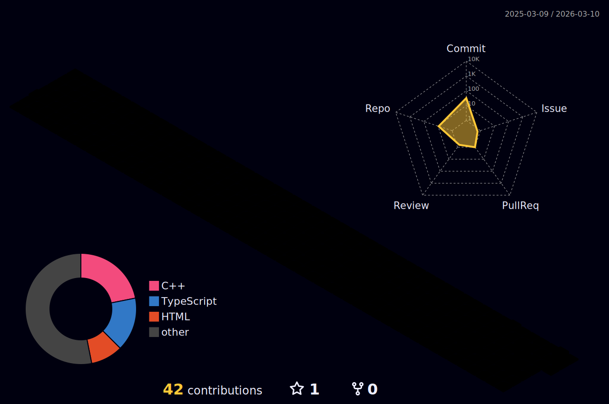

<!-- Header Wave -->


<!-- Typing Animation -->
<div align="center">
  
</div>

<br/>

<!-- About Me Terminal Block -->
```
chinmay@github:~$ whoami
┌──────────────────────────────────────────────────────────────────┐
│  chinmay@dwivedi                                                  │
│                                                                   │
│  OS:          CS Undergrad @ PES University, Bangalore           │
│  Uptime:      21 years, grinding since 2023                      │
│  Role:        GDG Mentor | Prime Intellect OSS Contributor       │
│  Languages:   C/C++, Python, JavaScript, SQL, HTML/CSS           │
│  Frameworks:  React, Node.js, FastAPI                            │
│  Tools:       Git, Docker, VS Code, Visual Studio                │
│  Interests:   Systems, Cryptography, CV, RL, Competitive Prog.  │
│                                                                   │
│  Currently:   Building RL environments for VirtualBox + SGLang   │
│               Mentoring @ Google Developer Group                  │
└──────────────────────────────────────────────────────────────────┘
```

---

## 🧠 About Me

- 🎓 **B.Tech CSE** @ PES University, Bangalore (2023–2027)
- 🤖 **Open Source Contributor** @ [Prime Intellect](https://github.com/PrimeIntellect-ai) — building RL environments for VirtualBox & SGLang
- 👨‍🏫 **Mentor** @ Google Developer Group — guiding devs on software best practices
- ⚔️ **Competitive Programmer** — 450+ problems solved, 30+ contests, Top ranks on Codeforces
- 🏆 **Top 10** @ Terrathon 3.0 — 24-hour inter-college hackathon
- 🔐 Obsessed with **cryptography**, **systems design**, and **computer vision**

---

## 🛠️ Tech Stack

<!-- Languages -->
<p align="center">
  
</p>

<!-- Frameworks & Tools -->
<p align="center">
  
</p>

<!-- Badges -->
<p align="center">
  
  
  
  
  
  
</p>

---

## 🚀 Featured Projects

<table>
  <tr>
    <td width="50%">
      <h3 align="center">🔐 Matrix Encryption</h3>
      <div align="center">
        <a href="https://github.com/chinmaydwivedi/matrix-encryption" target="_blank">
          
        </a>
      </div>
      <br/>
      <p>
        A <strong>novel cryptographic authentication system</strong> using evolving login schemes based on <strong>linear matrix transformations over GF(257)</strong>. Implements SHA-256 for secure code generation with cross-platform C++ and JavaScript support.
      </p>
      <p>
        
        
        
      </p>
    </td>
    <td width="50%">
      <h3 align="center">🅿️ Parking Detection System</h3>
      <div align="center">
        <a href="https://github.com/chinmaydwivedi/parking-detection" target="_blank">
          
        </a>
      </div>
      <br/>
      <p>
        Real-time <strong>computer vision application</strong> to detect and monitor parking space occupancy from video feeds using OpenCV and deep learning. Includes an analytics module for usage reports.
      </p>
      <p>
        
        
        
      </p>
    </td>
  </tr>
  <tr>
    <td colspan="2">
      <h3 align="center">⚡ RL Environment for VirtualBox + SGLang <em>(@ Prime Intellect)</em></h3>
      <p align="center">
        Built a <strong>reinforcement learning environment</strong> enabling automated agent interaction and training inside virtualized systems. Open-source contribution pushing the boundaries of distributed AI training.
      </p>
      <p align="center">
        
        
        
        
      </p>
    </td>
  </tr>
</table>

---

## 📊 GitHub Stats

<div align="center">
  
  
</div>

<div align="center">
  
</div>

---

## 🌐 3D Contribution Graph

<!-- 3D Contribution Calendar (github-profile-3d-contrib by yoshi389111) -->
<!-- To enable this, add a GitHub Action to your repo as described below -->

<div align="center">
  
</div>

> **ℹ️ To activate the 3D graph above**, create `.github/workflows/profile-3d.yml` in your profile repo:
>
> ```yaml
> name: GitHub-Profile-3D-Contrib
> on:
>   schedule:
>     - cron: "0 18 * * *"
>   workflow_dispatch:
> jobs:
>   build:
>     runs-on: ubuntu-latest
>     name: generate-github-profile-3d-contrib
>     steps:
>       - uses: actions/checkout@v3
>       - uses: yoshi389111/github-profile-3d-contrib@0.7.1
>         env:
>           GITHUB_TOKEN: ${{ secrets.GITHUB_TOKEN }}
>           USERNAME: ${{ github.repository_owner }}
>       - name: Commit & Push
>         run: |
>           git config user.email action@github.com
>           git config user.name GitHub Action
>           git add -A .
>           git commit -m "generated" || exit 0
>           git push
> ```

---

## ⚔️ Competitive Programming

<div align="center">

| Platform | Handle | Highlights |
|:---:|:---:|:---:|
| 🟦 **Codeforces** | [chinmaylk99](https://codeforces.com/profile/chinmaylk99) | Global Ranks: 5297, 6967, 7008 |
| 🟨 **LeetCode** | [chinmaydhardwivedi](https://leetcode.com/u/chinmaydhardwivedi) | 450+ Problems Solved |
| 🟧 **CodeChef** | chinmaydwivedi | 30+ Contests Participated |

</div>

<div align="center">
  
</div>

---

## 🏆 Achievements

<div align="center">
  
</div>

<br/>

```
🥇  Top 10 Finish     — Terrathon 3.0 (24-hr Inter-College Hackathon)
🌍  Global Rank 5297  — Codeforces Contest
🤝  Active Mentor     — Google Developer Group
🔓  OSS Contributor   — Prime Intellect (Distributed AI Research)
📈  450+ Problems     — Across CF, LC & CodeChef
```

---

## 📈 Activity Graph

<div align="center">
  
</div>

---

## 🤝 Connect With Me

<div align="center">
  <a href="mailto:chinmaydhardwivedi@gmail.com">
    
  </a>
  <a href="https://linkedin.com/in/chinmaydwivedii">
    
  </a>
  <a href="https://github.com/chinmaydwivedi">
    
  </a>
  <a href="https://codeforces.com/profile/chinmaylk99">
    
  </a>
  <a href="https://leetcode.com/u/chinmaydhardwivedi">
    
  </a>
</div>

---

<!-- Snake Animation -->
<div align="center">
  
</div>

> **ℹ️ To activate the snake animation**, create `.github/workflows/snake.yml`:
>
> ```yaml
> name: generate animation
> on:
>   schedule:
>     - cron: "0 */12 * * *"
>   workflow_dispatch:
> jobs:
>   generate:
>     permissions:
>       contents: write
>     runs-on: ubuntu-latest
>     steps:
>       - uses: Platane/snk/svg-only@v3
>         with:
>           github_user_name: ${{ github.repository_owner }}
>           outputs: |
>             dist/github-contribution-grid-snake.svg
>             dist/github-contribution-grid-snake-dark.svg?palette=github-dark
>       - uses: crazy-max/ghaction-github-pages@v3.1.0
>         with:
>           target_branch: output
>           build_dir: dist
>         env:
>           GITHUB_TOKEN: ${{ secrets.GITHUB_TOKEN }}
> ```

---

<!-- Footer Wave -->


<div align="center">
  
  <br/><br/>
  <em>"The best code is the code that doesn't need to be explained — but I'll explain it anyway."</em>
</div>
